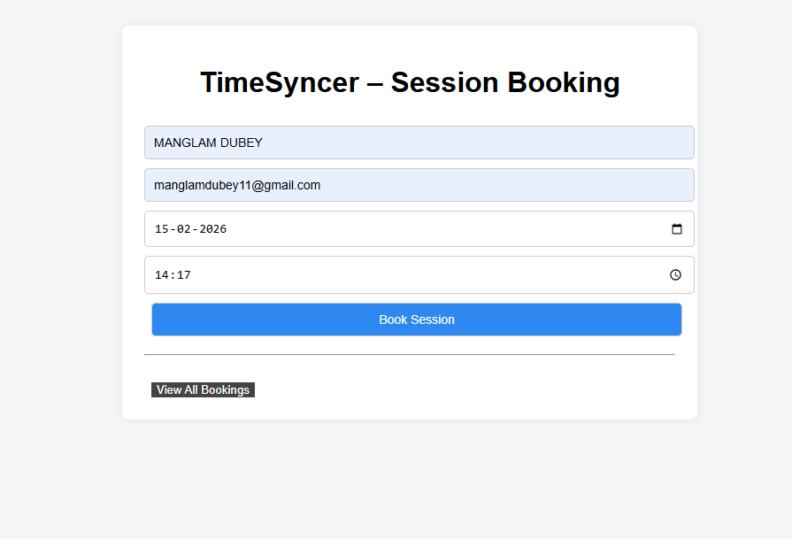
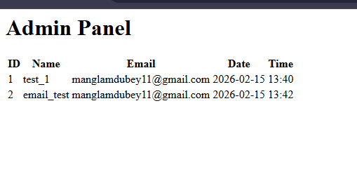
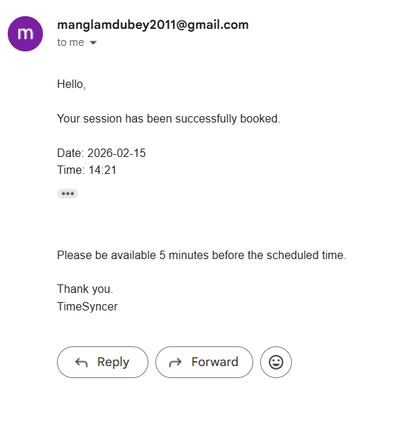
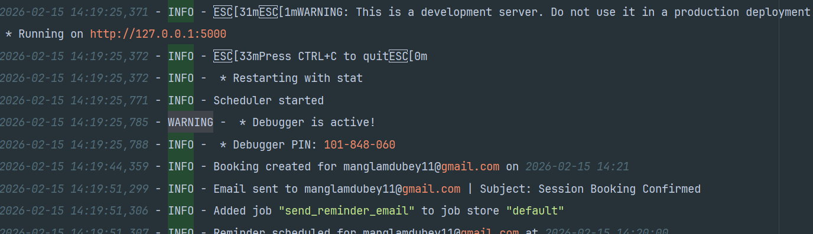

### 🚀 **TimeSyncer -- Session Booking System**
A clean and beginner-friendly web application built using Flask and SQLite that allows users to book time slots, receive confirmation emails, and get automatic reminders before their session starts.

This project was created as a practical learning project to understand backend development, database integration, email automation, and project structuring in a real-world scenario.

* * * * *

### 🌐 **Project Overview**
TimeSyncer is a simple web-based session booking system where users can:

- Book a session by selecting date and time\
- Prevent double booking for the same slot\
- Receive instant email confirmation\
- Receive reminder email before session\
- Admin can view all bookings\
- Logs are stored for debugging and tracking

This project demonstrates backend fundamentals and clean project structure suitable for internship/recruiter submission.

* * * * *

### 🧰 **Tech Stack**

### ⚙️ Backend
🐍 Python
🌐 Flask

### 🗄️ Database
🧱 SQLite3

### 📨 Email Service
✉️ SMTP (Gmail App Password)
🔐 dotenv for secure credentials

### 🎨 Frontend
🧾 HTML (Jinja Templates)
🎨 CSS

### 🛠️ Utilities
📝 Python logging module
📁 Structured service-based architecture
🧩 Modular Flask project setup

### 💻 Development Tools
🧪 Localhost testing
📦 Virtual environment (venv)
🐙 Git & GitHub version control

### 🧠 Core Features
📅 Slot-based booking system
⛔ Double-booking prevention
🔔 Email confirmation system
⏰ Automated reminder emails
📊 Admin dashboard


* * * * *

### 📂 **Project Structure (Professional Layout)**

TimeSyncer\
│\
├── app.py → Main Flask app\
├── requirements.txt\
├── .gitignore\
├── README.md\
├── .env (not pushed to GitHub)\
│\
├── services\
│ ├── db.py → Database logic\
│ ├── email_utils.py → Email sending\
│ ├── scheduler.py → Reminder system\
│ ├── logger_config.py \
│ └── **init**.py\
│\
├── templates\
│ ├── index.html\
│ ├── success.html\
│ ├── fail.html\
│ └── admin.html\
│\
├── static\
│ └── style.css\
│\
├── logs\
│ └── app.log\
├── database\(not pushed to GitHub)\
│ └── database.db


This modular structure keeps logic separated and maintainable.

* * * * *

### ✨ **Features**

🗓️ Slot Booking\
Users can book a session by entering name, email, date and time.

🚫 Double Booking Protection\
If a slot is already booked, system blocks it.

📧 Email Confirmation\
User receives confirmation immediately after booking.

⏰ Reminder Email\
System sends reminder before session time.

🛠️ Admin Panel\
Admin can view all bookings at /admin route.

🧾 Logging System\
All important events stored in logs/app.log\
Useful for debugging and tracking.

🧱 Clean Code Structure\
Code split into services like professionals do.

* * * * *

### 📸 **Screenshots Section (Add Your Images Here)**

#### 1️⃣ Home Booking Page

#### 2️⃣ Admin Panel View

#### 3️⃣ Email Confirmation Screenshot 

#### 4️⃣ Logs File Screenshot



Tip: Create a folder named screenshots in repo and upload images.

* * * * *

### ⚙️ **Setup Instructions**

1.  Clone repository
   ``` git clone https://github.com/Manglam11/session_booking_system.git ```
2.  Open project folder

3.  Create virtual environment\
    ``` python -m venv venv ```

4.  Activate virtual environment\
    ``` venv\Scripts\activate ```

5.  Install dependencies\
    ``` pip install -r requirements.txt ```

6.  Create .env file\
### Add:

#### EMAIL_USER=your_gmail@gmail.com
#### EMAIL_PASS=your_app_password

7. Run project\
    ``` python app.py ```

8. Open browser\
    ```http://127.0.0.1:5000```

* * * * *

🔐 **Environment Variables**

This project uses .env file for security.

Never push:
- Gmail password
- App password
- .env file

* * * * *

### 🧪 **Test Flow**

```
  Book a session → Check confirmation email → Try booking same slot (will fail) →
  Visit /admin → See bookings → Check logs/app.log
 
  ```

* * * * *

### 🧠 **Concepts Learned**

- Flask routing
- HTML templates
- SQLite database integration
- SMTP email sending
- Environment variables
- Logging system
- Project structuring
- Preventing duplicate bookings

* * * * *

### 🎯 **Why This Project Matters**

This project demonstrates:

✔ Real backend logic\
✔ Clean folder structure\
✔ Email automation\
✔ Database handling\
✔ Production-style code organization

* * * * *

### 👨‍💻 **Future Improvements**

- Login system for admin
- Deploy on Render/Railway
- Add calendar view
- Add slot availability view
- Use PostgreSQL instead of SQLite
- Add UI styling 

* * * * *

### 📬 **Project Author**

#### Name: Manglam
- **GitHub:** Click[ here](https://github.com/Manglam11)
- **LinkedIn:** Click[ here](https://www.linkedin.com/in/manglam-dubey/)


* * * * *
